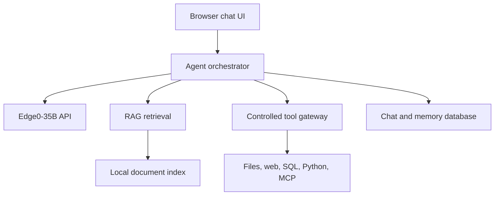

Absolutely. Edge0 can become the local reasoning engine for a complete private assistant with persistent conversations, document RAG, citations, tool use, memory, and a polished browser interface.

The important architectural choice is: don’t heavily modify Edge0. Keep it as the fast inference server and build an orchestration layer in front of it.



## What Edge0 currently provides

Edge0 already gives us:

* A capable 35B-class local model
* OpenAI-style chat completions
* Conversation messages
* Streaming responses
* Local/private inference
* Approximately 2,048 generated tokens by default

But it does not currently provide:

* An embeddings endpoint
* Native OpenAI `tools` or `tool_calls`
* Document ingestion or retrieval
* Persistent conversations
* Long-term memory
* Authentication or user permissions
* A graphical chat interface
* Concurrent generation—requests are processed one at a time

Therefore, those features belong in the layer above Edge0.

## Fastest first step: Open WebUI

Open WebUI can immediately provide chat history, file uploads, knowledge collections, RAG, model configurations, and a browser interface. Its current platform supports OpenAI-compatible APIs, hybrid retrieval, reranking, tools, and knowledge bases. [Open WebUI documentation](https://docs.openwebui.com/)

Leave Edge0 running on port 8000. In another Terminal:

```bash
brew install uv

mkdir -p "$HOME/.open-webui"

DATA_DIR="$HOME/.open-webui" \
uvx --python 3.11 open-webui@latest serve --port 8080
```

Open:

```text
http://localhost:8080
```

In Open WebUI, add an OpenAI-compatible connection:

| Setting  | Value                      |
| -------- | -------------------------- |
| Base URL | `http://127.0.0.1:8000/v1` |
| API key  | `local-edge0`              |
| Model    | `edge0-35b`                |

This should immediately give you a proper local chat interface and persistent chat history.

For RAG:

1. Open the Knowledge area.
2. Create a knowledge base.
3. Upload a few test PDFs or Word documents.
4. Attach that knowledge base to an Edge0 model configuration.
5. Ask questions whose answers can be verified directly against those documents.

Open WebUI presently supports vector retrieval, BM25 hybrid search, reranking, multiple extraction engines, and full-document injection. [Knowledge and RAG features](https://docs.openwebui.com/features/)

## Reliable tool use requires an agent wrapper

Edge0’s API accepts ordinary text messages, but it does not parse an OpenAI `tools` request or emit structured `tool_calls`. Passing tool definitions directly to port 8000 will not produce standard function-calling behavior.

We can overcome that with a small local agent service that uses a strict response protocol:

```json
{
  "action": "tool",
  "tool": "search_documents",
  "arguments": {
    "query": "ED arrival forecasting distribution drift"
  }
}
```

Or:

```json
{
  "action": "answer",
  "content": "The evidence indicates...",
  "citations": ["document-17, page 4"]
}
```

The orchestrator would:

1. Send the conversation and allowed-tool descriptions to Edge0.
2. Validate Edge0’s structured response.
3. Execute only an allowlisted tool.
4. Return the result to Edge0.
5. Repeat until Edge0 gives a final answer.
6. Record every invocation in an audit log.

Malformed output would be rejected and automatically retried rather than accidentally executed.

## Initial tool set

I would begin with low-risk, high-value tools:

| Tool                               | Initial policy                                |
| ---------------------------------- | --------------------------------------------- |
| Search uploaded documents          | Automatic                                     |
| Read cited document passage        | Automatic                                     |
| Calculator                         | Automatic                                     |
| Current date/time                  | Automatic                                     |
| Search approved local folders      | Automatic                                     |
| Read an approved file              | Automatic                                     |
| Query a designated SQLite database | Read-only                                     |
| Query SQL Server                   | Read-only, statement validation               |
| Search the public web              | Ask before sending potentially sensitive text |
| Create a draft file                | Ask before writing                            |
| Execute Python                     | Sandboxed workspace                           |
| Shell commands                     | Disabled initially                            |
| Delete or modify files             | Explicit confirmation every time              |

Later, the gateway could support MCP servers, email, calendar, GitHub, Slack, and other services.

## A trustworthy RAG pipeline

For serious document use, especially clinical or administrative material, “embed some chunks and retrieve five” is insufficient. I would build:

1. **Document ingestion**

   PDF, DOCX, Markdown, HTML, text, CSV, and OCR for scanned documents.

2. **Structure-aware chunking**

   Preserve headings, pages, tables, sections, document dates, and source filenames.

3. **Local embeddings**

   A dedicated small embedding model—not Edge0—running locally on the Mac.

4. **Hybrid retrieval**

   Combine semantic vector search with exact lexical/BM25 search.

5. **Reranking**

   Rerank the retrieved candidates before giving them to Edge0.

6. **Citation enforcement**

   Every factual document-derived assertion links to its source, page, and quoted supporting span.

7. **Abstention**

   If retrieved evidence is weak or conflicting, say so instead of filling gaps.

8. **Prompt-injection protection**

   Uploaded documents are treated as untrusted evidence, never as instructions to the agent.

## Memory

We should separate three things commonly called “memory”:

* **Conversation history:** full messages for the current chat.
* **Conversation summary:** compressed older history to control prompt size.
* **Durable memory:** explicitly approved preferences, project facts, and decisions with provenance.

The assistant should never silently turn every conversation into permanent memory. Proposed memories should be visible, editable, and removable.

## Recommended implementation path

### Phase 1: Useful immediately

* Install Open WebUI
* Connect Edge0
* Enable persistent chats
* Test document upload and basic RAG
* Test response quality and context limits

### Phase 2: Reliable local RAG

* Dedicated ingestion service
* Local embedding model
* Hybrid search and reranking
* Page-level citations
* Folder synchronization
* Retrieval evaluation set

### Phase 3: Controlled agent tools

* Structured tool protocol
* Pydantic validation
* Tool registry and permission levels
* Calculator, document search, local files, Python
* Confirmation interface
* Complete audit trail

### Phase 4: Personal workbench

* Project workspaces
* Durable memory
* SQL and GitHub connectors
* Multiple local/cloud model routing
* Background tasks
* Exportable chats and reports
* Evaluation and observability dashboard

My recommendation is to install Open WebUI first and validate Edge0 as an everyday chat and RAG model. Then build a sibling project—perhaps `Edge0-Workbench`—for reliable tool calling and higher-quality, citation-grounded RAG. That preserves upstream Edge0 while giving us complete control over safety and functionality.

