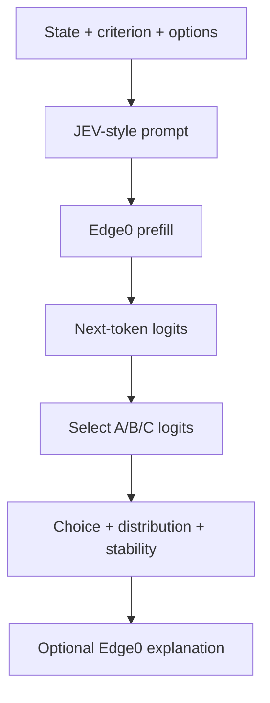
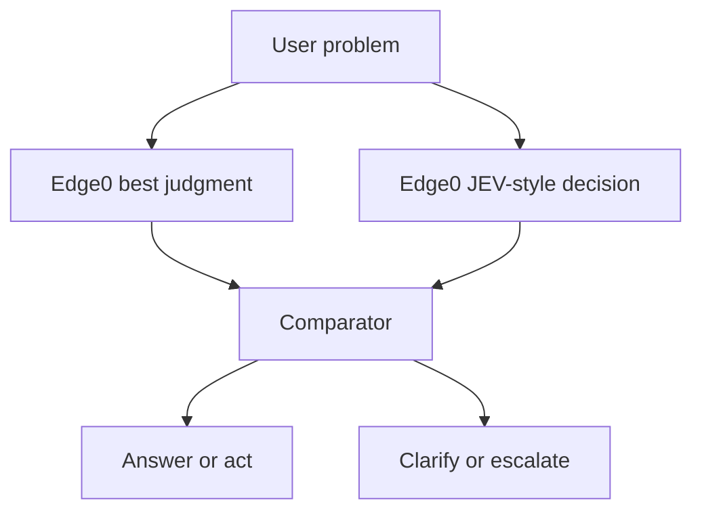

Yes. On your M4/64 GB Mac, there are two useful ways to run JEV-CPU:

1. **Web interface:** Qwen3-0.6B using PyTorch on CPU—easiest demonstration.
2. **Native Apple Silicon mode:** Qwen3.5-4B using MLX—substantially better decision quality, but currently command-line only.

Important distinction: this repository is not the proprietary TypeSafe Jev model. It is an independent CPU/MLX adaptation of the open SemIf method. It performs typed classification by comparing option logits; it is not a generative chatbot. See the [JEV-CPU model card](https://huggingface.co/Meanblock/JEV-CPU) and [source repository](https://github.com/leesk212/JEV-CPU).

## 1. Clone into a separate environment

Do not install this into the Edge0 environment.

```bash
cd ~/Developer

git clone https://huggingface.co/Meanblock/JEV-CPU.git
cd JEV-CPU

/opt/homebrew/bin/python3.12 -m venv .venv

./.venv/bin/python -m pip install --upgrade pip setuptools wheel
./.venv/bin/python -m pip install -e .
```

Verify:

```bash
./.venv/bin/python --version
./.venv/bin/python -c 'import torch, transformers; print("Torch:", torch.__version__); print("Transformers:", transformers.__version__)'
```

## 2. Run the terminal demonstration

```bash
./.venv/bin/python semif_cpu.py
```

The first run downloads `Qwen/Qwen3-0.6B`. It loads approximately 2.4 GB into memory as FP32 and then runs two example decisions.

Expected output resembles:

```text
=== decision: sentiment ===
  → choice: negative
    negative   97.4%
    neutral     2.1%
    positive    0.5%
```

It generates no explanatory text. It performs one forward pass and reports probabilities across the options you supplied.

## 3. Run the browser interface

The supplied server binds to every network interface. Before using it with anything sensitive, restrict it to your Mac:

```bash
sed -i '' 's/0\.0\.0\.0/127.0.0.1/g' server.py
```

Start it:

```bash
./.venv/bin/python server.py
```

Open:

```text
http://127.0.0.1:8080
```

The model loads during server startup. Then:

1. Enter evidence or state in the upper-left panel.
2. Define one or more questions.
3. Give each question two or more possible answers.
4. Click **Run decisions**.
5. Examine the option probabilities.

Test its health from another Terminal:

```bash
curl http://127.0.0.1:8080/api/health
```

### If port 8080 is occupied

Open WebUI also defaults to port 8080. Change JEV-CPU to 8081:

```bash
sed -i '' 's/^PORT = 8080$/PORT = 8081/' server.py
```

Then run it and open:

```text
http://127.0.0.1:8081
```

## 4. Try an ED example

Use this as the state:

```text
Current ED census is 71. There are 14 admitted patients boarding,
five patients awaiting ICU beds, eight patients in the waiting room,
and predicted arrivals exceed available treatment spaces for the next
four hours. Nursing staffing is two positions below plan.
```

Criterion:

```text
What is the predicted operational strain during the next four hours?
```

Options:

| ID           | Description                                            |
| ------------ | ------------------------------------------------------ |
| low          | Capacity should comfortably exceed demand.             |
| moderate     | Demand may temporarily approach capacity.              |
| high         | Demand is likely to exceed available staffed capacity. |
| insufficient | The supplied evidence is insufficient to decide.       |

A second criterion could be:

```text
Should the predefined operational escalation workflow be activated?
```

Options:

* `activate`: The defined escalation threshold is met.
* `monitor`: Continue monitoring without activation.
* `insufficient`: Evidence is insufficient.

This is where the design becomes interesting: criteria and available actions are defined at runtime, but the output is always restricted to those typed choices.

## 5. Use the native MLX backend

The project now includes an Apple Silicon MLX backend using Qwen3.5-4B. This is the version I would evaluate seriously on your Mac because the repository’s own results show the 0.6B model is an accuracy floor, while the 4B model performs substantially better.

Install the additional dependencies:

```bash
./.venv/bin/python -m pip install -e '.[test,mlx]'
```

Run the included decisions using the pinned model revision:

```bash
./.venv/bin/semif-score \
  --backend mlx \
  --mode direct \
  --model Qwen/Qwen3.5-4B \
  --revision 851bf6e806efd8d0a36b00ddf55e13ccb7b8cd0a \
  --input examples/decisions.jsonl \
  --output results-mlx-direct.jsonl
```

The first run downloads approximately 9 GB. Your 64 GB Mac has ample capacity.

View the decisions:

```bash
jq '{
  id,
  choice,
  option_ids,
  probabilities,
  forward_seconds,
  input_tokens
}' results-mlx-direct.jsonl
```

If the exact key names differ:

```bash
jq . results-mlx-direct.jsonl
```

The output file is deliberately create-only. For another run, supply a new filename:

```bash
--output results-mlx-direct-2.jsonl
```

Full Apple Silicon details are in the project’s [MLX documentation](https://github.com/leesk212/JEV-CPU/blob/main/docs/MLX.md).

## Which version to use

| Goal                          | Recommended version                                      |
| ----------------------------- | -------------------------------------------------------- |
| Understand the interface      | 0.6B web UI                                              |
| Quick demonstrations          | 0.6B web UI                                              |
| Serious evaluation            | Qwen3.5-4B MLX                                           |
| Highest repeatable precision  | MLX BF16, no quantization                                |
| Lower memory usage            | MLX with `--mlx-bits 8`                                  |
| Production clinical decisions | Neither without task-specific validation and calibration |

One especially important caveat: the displayed softmax percentages are conditional probabilities across the offered options. They are not automatically calibrated real-world confidence. For your work, I would treat JEV-CPU as an experimental decision primitive and evaluate discrimination, calibration, abstention, option-order sensitivity, and stability under paraphrasing before attaching operational meaning to the percentages.


Yes. We can make Edge0 perform JEV-style decisions directly, using its 35B MoE model instead of JEV-CPU’s 0.6B or 4B model.

This is technically feasible because Edge0 already exposes the exact primitive JEV needs: after prompt prefill, `next_logits()` returns the full next-token logits. JEV then selects only the logits corresponding to option letters—A, B, C—and converts them into probabilities. See Edge0’s [`engine/base.py`](https://github.com/Edge0-AI/Edge0/blob/main/src/edge0/engine/base.py) and [`engine/qwen.py`](https://github.com/Edge0-AI/Edge0/blob/main/src/edge0/engine/qwen.py).

## Recommended architecture

Add a decision endpoint to the existing Edge0 server:



The same loaded Edge0 engine would support:

* `/v1/chat/completions` for normal generation
* `/v1/decisions` for fast typed decisions
* Later, `/v1/decision-batch` for several criteria against one state

We should extend the existing Edge0 server rather than start a separate process. Otherwise, the second service would load another copy of the model.

## Proposed request

```json
{
  "state": "ED census is 71, with 14 admitted boarders...",
  "criterion": "What is the projected operational strain over four hours?",
  "options": [
    {
      "id": "low",
      "description": "Capacity should comfortably exceed demand."
    },
    {
      "id": "moderate",
      "description": "Demand may temporarily approach capacity."
    },
    {
      "id": "high",
      "description": "Demand is likely to exceed staffed capacity."
    },
    {
      "id": "insufficient",
      "description": "The supplied evidence is insufficient."
    }
  ]
}
```

Response:

```json
{
  "choice": "high",
  "probabilities": {
    "low": 0.01,
    "moderate": 0.11,
    "high": 0.82,
    "insufficient": 0.06
  },
  "margin": 0.71,
  "entropy": 0.61,
  "stable_across_permutations": true,
  "model": "edge0-35b",
  "method": "option_logit_readout"
}
```

I would deliberately call these `probabilities`, not calibrated confidence.

## How it would work internally

For every decision:

1. Reset Edge0’s request state.
2. Assign each option a letter.
3. Render a strict no-thinking prompt:

```text
Apply the criterion to the evidence.
Choose exactly one option.
Respond with only its uppercase letter.

Evidence:
...

Criterion:
...

A. Capacity should comfortably exceed demand.
B. Demand may temporarily approach capacity.
C. Demand is likely to exceed staffed capacity.
D. The evidence is insufficient.
```

4. Verify that `A`, `B`, `C`, and `D` each map to exactly one tokenizer token.
5. Prefill the prompt through Edge0.
6. Read `engine.next_logits()`.
7. Extract only the four option-token logits.
8. Apply softmax across those four values.
9. Return the distribution without generating any text.

Edge0’s existing streaming-expert and prerouter machinery remains active during that forward pass.

## Better still: combine decision and judgment

The strongest design is not simply “replace JEV’s model with Edge0.” It is a two-path system:

| Path                      | Role                                                                     |
| ------------------------- | ------------------------------------------------------------------------ |
| Edge0 generative judgment | Analyze nuance, reconstruct state, identify missing information, explain |
| Edge0 logit decision      | Produce a bounded distribution across declared actions                   |
| Comparator                | Detect disagreement, instability, or excessive uncertainty               |
| Guardrail                 | Decide whether to act, ask, abstain, or escalate                         |

For example:



This fits extremely well with your earlier “just use your best judgment” comparator concept. The generated judgment becomes one channel; the typed probability distribution becomes another. Meaningful disagreement is more informative than either answer alone.

## Reliability protections

A raw single-pass distribution should not be trusted by itself. I would add:

* Always include an `insufficient` or `cannot_determine` option where appropriate.
* Randomize option ordering and repeat the decision several times.
* Map results back to stable option IDs.
* Measure whether the winner changes when option order changes.
* Test paraphrased criteria and descriptions.
* Report entropy, top-two margin, and permutation stability.
* Calibrate probabilities against a labeled validation set for each domain.
* Reject decisions when stability or calibration thresholds fail.
* Never equate a 95% softmax value with a 95% real-world probability without calibration.

## Practical limitations

* Edge0 serializes inference, so chat and decisions share one queue.
* It currently has one mutable KV cache; JEV’s shared-prefix branching is not implemented.
* A first version would therefore run each criterion independently.
* Edge0’s Recover-LoRA was not trained specifically for option-logit classification. The method must be tested against the Qwen3.5-4B JEV baseline rather than assumed superior merely because Edge0 is larger.
* The 35B model may deliver better semantic discrimination, but its adapter and quantization could distort probability calibration.

## Best build sequence

1. Add an in-process `Edge0DecisionScorer`.

2. Add `/v1/decisions`.

3. Port JEV’s row validation and single-token option checks.

4. Add permutation-stability testing.

5. Create a benchmark comparing:

   * JEV-CPU 0.6B
   * JEV MLX 4B
   * Edge0-35B logit readout
   * Ordinary Edge0 generated judgment
   * Combined comparator

6. Only then add explanation generation, tool routing, and automated actions.

This would turn Edge0 from merely a chatbot into both a slower deliberative model and a constrained, decision-native controller—using one locally loaded model.
